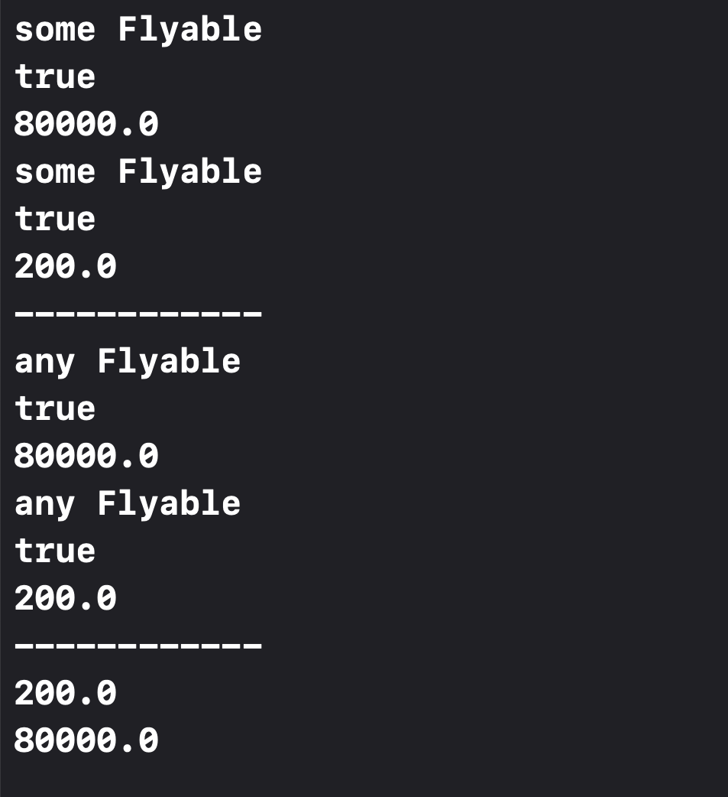

# Swift-SomeVsAny
Some vs Any. Existential Type vs Opaque Types. 

The difference between `some` and `any` in Swift pertains to how types are handled and what guarantees are provided by the compiler. Here’s a detailed explanation:

### `any` (Existential Types)
The `any` keyword is used to indicate an existential type, which allows you to store and work with values of any type that conforms to a protocol. Existential types provide a way to handle values of unknown concrete types as long as they conform to a specified protocol. This is useful for writing generic code that can operate on a variety of types.

#### Key Characteristics:
1. **Type Erasure:** Existential types use type erasure to hide the underlying type. You lose information about the specific type, retaining only the knowledge that it conforms to the protocol.
2. **Flexibility:** You can store heterogeneous collections of types conforming to the protocol.
3. **Dynamic Dispatch:** Existential types use dynamic dispatch to call methods, which can be less efficient than static dispatch.

### `some` (Opaque Types)
The `some` keyword is used to denote opaque types, which hide the specific type of the value from the caller but still retain the concrete type information internally. This allows the compiler to optimize and enforce type consistency.

#### Key Characteristics:
1. **Type Consistency:** The concrete type is hidden but consistent. This means the caller knows that the type conforms to the protocol but does not know the exact type. However, the same type is used consistently across different calls and uses.
2. **Compile-Time Guarantees:** The compiler retains information about the specific type, allowing for optimizations and type safety.
3. **Static Dispatch:** Opaque types use static dispatch, which can be more efficient than dynamic dispatch.

### Practical Differences in Use

#### Existential Type Example (`any`):
```swift
func anyFly(_ flyingObject: any Flyable) {
    print("any Flyable")
    print(flyingObject.canFly)
    print(flyingObject.distance)
}
```
- Can accept any type that conforms to `Flyable`.
- Useful when you need to handle a variety of types that conform to the same protocol.
- Allows for storing different conforming types in collections.

#### Opaque Type Example (`some`):
```swift
func someFly(_ flyingObject: some Flyable) {
    print("some Flyable")
    print(flyingObject.canFly)
    print(flyingObject.distance)
}
```
- Expects a specific, consistent type that conforms to `Flyable`.
- The concrete type is determined at compile time but is not revealed.
- Ensures type consistency and can optimize for the specific type used.

### Example to Illustrate Differences

Let's consider a scenario where these differences become significant:

```swift
protocol Flyable {
    var canFly: Bool { get }
    var distance: Double { get }
}

class Aeroplane: Flyable {
    var canFly: Bool { return true }
    var distance: Double { return 80000.0 }
}

class Bird: Flyable {
    var canFly: Bool { return true }
    var distance: Double { return 200 }
}

func returnAnyFlyable() -> any Flyable {
    return Bool.random() ? Aeroplane() : Bird()
}

func returnSomeFlyable() -> some Flyable {
    return Aeroplane()
}

let anyFlyable = returnAnyFlyable()
print(anyFlyable.distance) // This could be from either Aeroplane or Bird, decided at runtime.

let someFlyable = returnSomeFlyable()
print(someFlyable.distance) // This will always be from Aeroplane, known at compile-time.
```

### Summary

- **`any` (Existential Types):** Provides flexibility, allows for heterogeneous collections, uses type erasure, and involves dynamic dispatch.
- **`some` (Opaque Types):** Provides type consistency and compile-time guarantees, allows for optimizations, uses static dispatch, and hides the concrete type from the caller while ensuring it remains consistent.

These differences make `some` ideal for cases where you want the performance benefits and type safety of a known but hidden type, while `any` is better for scenarios where flexibility and type-agnosticism are needed.

### Output 

